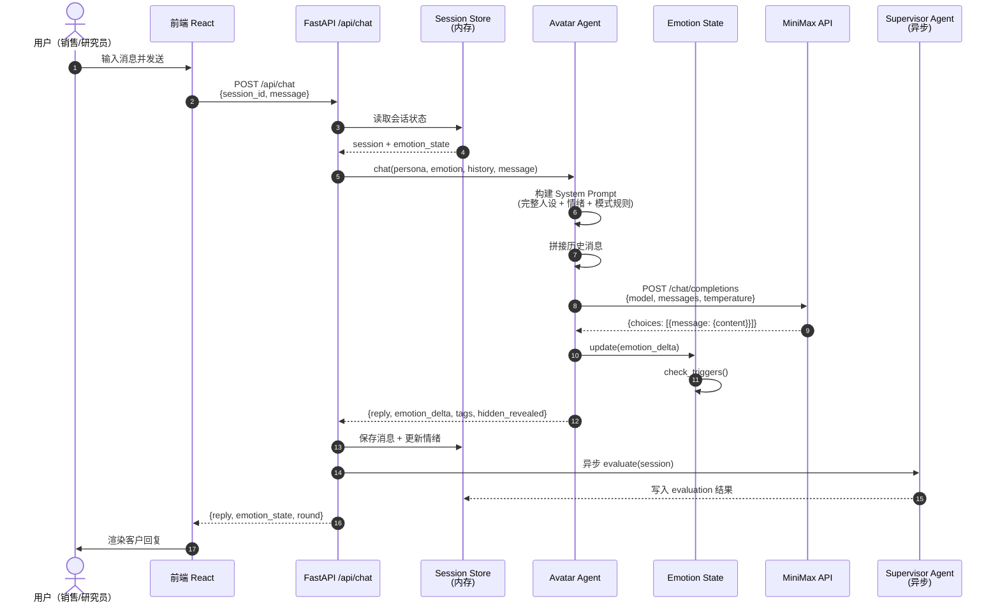
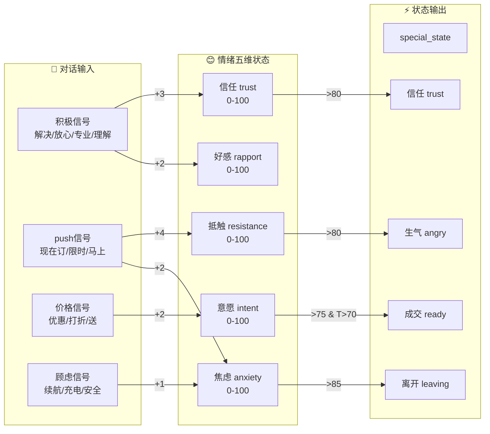
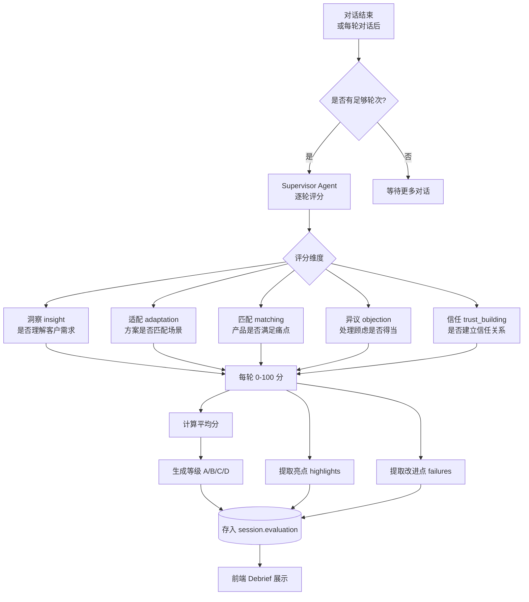
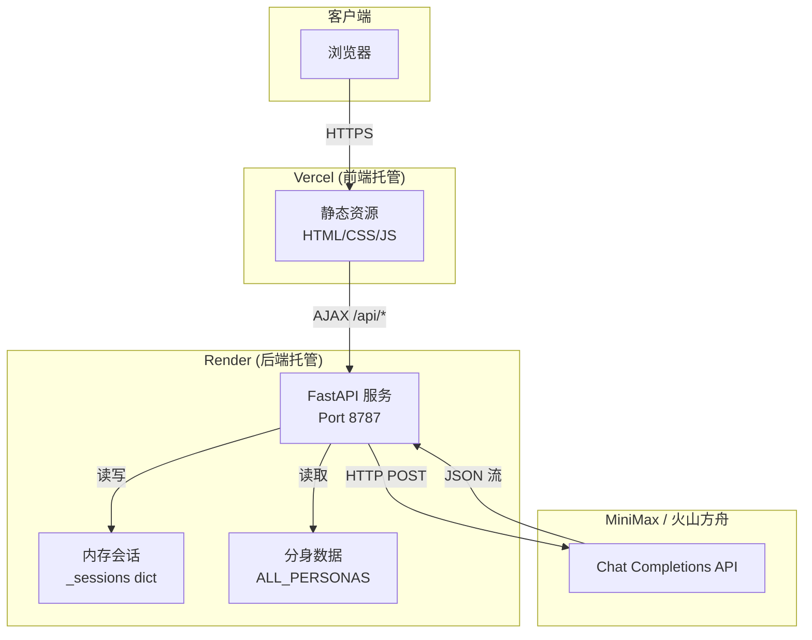
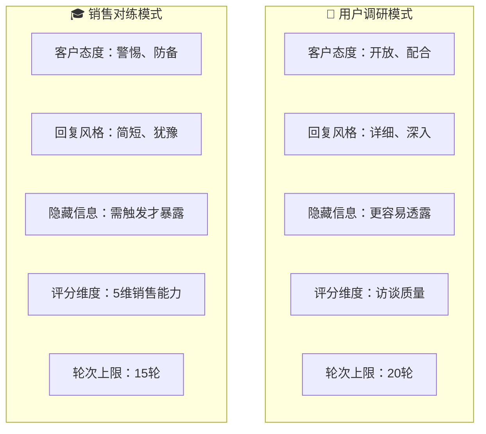

# CAP 客户分身平台 — 完整流程图

> 本文档用 Mermaid 语法编写，可在 GitHub、Notion、Typora、VS Code（Mermaid 插件）中直接渲染。

---

## 一、用户全流程（从前端到后端）

```mermaid
flowchart TB
    subgraph FE["🖥️ 前端 (React + Vite)"]
        A["📱 Splash 启动页<br/>品牌展示 2s"] --> B{"是否首次访问?"}
        B -->|是| C["🎯 Onboarding 引导页<br/>选择角色身份"]
        B -->|否| D["🏠 Home 首页<br/>展示功能入口"]
        C --> D
        D --> E1["🎓 开始销售对练"]
        D --> E2["🔬 开始用户调研"]
        E1 --> F["👤 Persona 选择页<br/>浏览客户分身卡片"]
        E2 --> F
        F --> G["💬 Chat 对话页<br/>实时对话交互"]
        G --> H{"是否结束?"}
        H -->|继续对话| G
        H -->|达到轮次上限<br/>或主动结束| I["📊 Debrief 报告页<br/>评分与反馈"]
        I --> J1["🏠 返回首页"]
        I --> J2["📋 查看历史记录"]
    end

    subgraph BE["⚙️ 后端 (FastAPI)"]
        K1[("内存会话存储<br/>_sessions")]
        K2["🎭 Avatar Agent<br/>分身对话引擎"]
        K3["📈 Supervisor Agent<br/>督导评估引擎"]
        K4["📄 Analyst Agent<br/>报告生成引擎"]
        K5["😊 Emotion State<br/>情绪状态机"]
        K6[("客户分身数据库<br/>ALL_PERSONAS")]
    end

    subgraph AI["🤖 AI 模型 (MiniMax M2.7)"]
        M1["文本生成 API"]
    end

    F -.->|POST /api/session/create| K1
    G -.->|POST /api/chat| K2
    K2 -->|调用| M1
    M1 -->|返回回复| K2
    K2 --> K5
    K5 --> K1
    K2 -.->|异步触发| K3
    K3 -.->|写入评分| K1
    I -.->|GET /api/session/{id}/evaluation| K1
    I -.->|POST /api/session/{id}/report| K4
    K4 -->|调用| M1
    K4 -.->|生成报告| K1
```

---

## 二、单次对话内部流程（Chat API）



---

## 三、情绪状态机流转



---

## 四、督导评估流程（异步）



---

## 五、数据流全景图



---

## 六、两种模式差异对比



---

*文档版本：v1.0 | 基于 CAP Platform MVP 代码生成*
